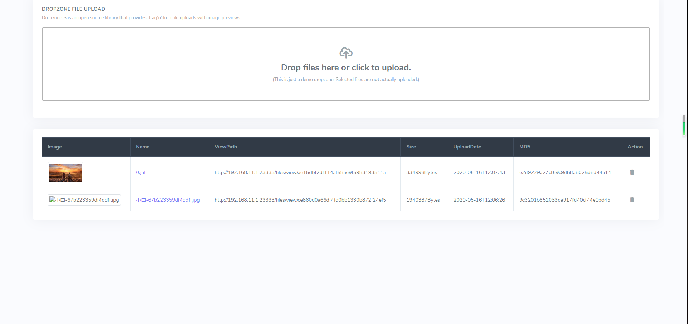

# 文件服务系统（Java + MySQL版本）

## 项目展示

## 使用工具版本

- Java 1.8
- SpringBoot `2.2.4`
- MyBatis-Plus `3.2.0`
- MySQL `5.7.0+`

## 接口文档

- `GET` **/** or **/index** or **/index.html** : 进入首页

- `POST` **/files/upload** : 上传文件接口
    - `file` : 传输 `MultipartFile` 文件

- `GET` **/files/{file_id}** : 下载文件信息

- `GET` **/files/view/{file_id}** : 在线展示图片信息

- `GET` **/files/delete/{file_id}** : 删除对应的图片数据

## 改进建议

MySQL 始终不适合用于存储大型文件，之后会改用 Mongdb